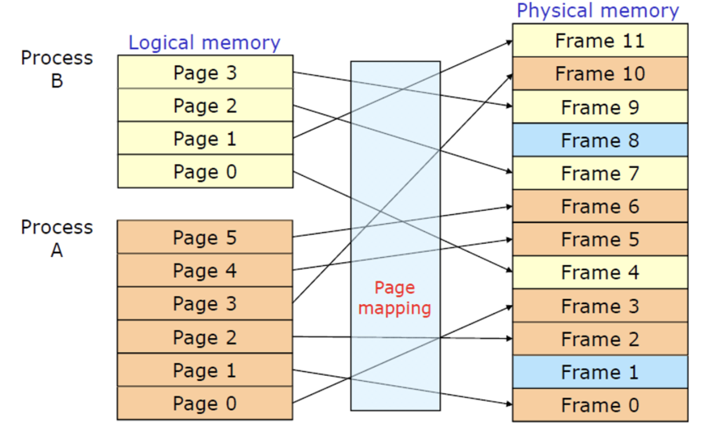

# 10주차 스터디 정리 : Main Memory

## Memory Space
- 메모리가 올바르게 동작하기 위해서는, 각각의 프로세스가 **독립된 메모리 공간**을 가지도록 보장해야 한다.
- 개별적인 메모리 공간을 분리하기 위해서는 특정 프로세스만 접근할 수 있는 합법적인(Legal) 메모리 주소 영역을 설정하고, 프로세스가 합법공간만 접근하도록 하는 것이 필요하다. 
- base 레지스터와 limit 레지스터를 통해, 해당 구역 내의 메모리 공간을 프로세스에게 합법적인 메모리 주소 영역으로 할당한다. 

## Address Binding
- 프로그램은 디스크에 binary 실행파일의 형태로 저장되어 있다. 
- 프로그램을 실행하려면, 프로그램을 메모리로 가져와야한다. 

## Paging 
 
