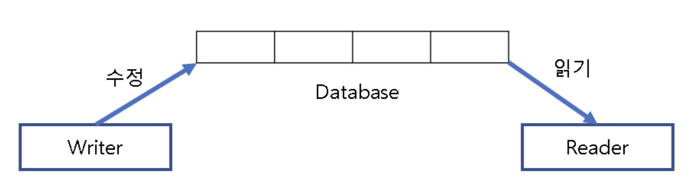
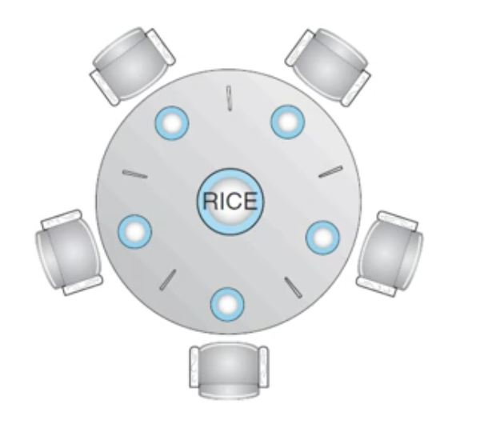

# 8주차 스터디 정리

## 동시성 제어 문제들(Concurrency-Control Problems)
- The Bounded-Buffer Problem
- The Readers-Writers Problem
- The Dining-Philosophers Problem
  
  
## The Bounded-Buffer Problem

  

**Shared Data Structures**  
```c
    int n;
    semaphore mutex = 1;
    semaphore empty = n;
    semaphore full = 0;
```
- A binary semaphore **mutex** : mutual exclusion을 보장해주는 세마포어
- Two counting semaphores **empty and full** : empty와 full 버퍼의 개수를 세기 위한 세마포어
  
**Producer Process의 구조**  
```c
    while (true) {
        // produce an item in next_produced

        wait(empty); // consumer가 버퍼를 다 비울 때까지 wait
        wait(mutex); // 여러 개의 producer 중에 하나만 버퍼에 진입할 수 있도록

        // add next_produced to the buffer

        signal(mutex); // c.s 구간 실행 완료 후, mutex 반납
        signal(full); // 모든 producer들이 생산을 완료하면, consumer들이 버퍼에 접근하도록 알림
    }
```
  
**Consumer Process의 구조**  
```c
    while (true) {
        wait(full);
        wait(mutex);

        // remove an item from buffer to next_consumed

        signal(mutex);
        signal(empty);

        // consume an item in next_consumed
    }
```
  
  
## The Readers-Writers Problem


- readers와 writers가 하나의 데이터베이스를 공유하는 상황
- readers는 DB를 read하는 역할만 수행
- writers는 read & write 둘 다 수행
- writer가 c.s에 있을 때, 다른 writers와 readers가 c.s에 접근하지 못하도록 막아야함
- 반면, reader는 shared data를 읽는 작업만 수행하니 다른 readers들이 함께 데이터를 읽는 것을 허용함
  
  
**Shared Data Structures**  
```c
    semaphore rw_mutex = 1;
    semaphore mutex = 1;
    int read_count = 0;
```
- rw_mutex
- mutex
- read_count : 몇 개의 process들이 현재 shared data를 read 중인지
  

**Writer Process의 구조**
```c
    while (true) {
        // Writer가 공유 자원에 접근하면, 다른 모든 프로세스들의 접근을 차단함
        // binary semaphore로 다른 프로세스들의 c.s 진입을 차단
        wait(rw_mutex);

        // writing is performed

        signal(rw_mutex);
    }
```
  
  
**Reader Process의 구조**  
```c
    while (true) {
        wait(mutex); // read_count에 대한 mutual exclusion을 보장하기 위한 설정
        read_count++; // read count가 0이라면 1 증가시킴

        if(read_count == 1) wait(rw_mutex); // 만약 read_count가 1이라면, writer는 c.s에 진입하지 못함
        signal(mutex);

        // reading is performed

        wait(mutex);
        read_count--; // reading 수행 이후, read_count를 1 감소시킴
        if(read_count == 0) signal(rw_mutex); // c.s에 머물러 있는 reader가 하나도 없을 때, writer는 c.s에 진입할 수 있다. 
        signal(mutex);
    }
```
  

## The Dining-Philosophers Problem


철학자 5명이 식탁 가운데 음식을 두고 철학자들은 사색(thinking)과 식사(eating)를 반복한다. 젓가락은 총 5개, 단 음식을 먹으려면 2개의 젓가락을 사용해야 한다. 즉, 동시에 음식을 먹을 수 있는 사람은 두 명뿐이다. 운이 좋으면 5명의 철학자들이 돌아가면서 사색과 식사를 이어갈 수 있다. 하지만 모두가 젓가락을 하나씩 들고 식사를 하려하면 누구도 식사를 할 수 없는 상태, 다시말해 데드락에 빠져 버린다. 이것이 바로 철학자들의 만찬 문제(Dining-Philosophers Problem)이다.

**식사하는 철학자 문제 알고리즘**
```c
    while (true) {
        wait(chopstick[i]); // 왼쪽 젓가락 집기
        wait(chopstick[(i+5) % 5]); // 오른쪽 젓가락 집기

        // 젓가락 2개 다 집으면 => eating

        signal(chopstick[i]); // 왼쪽 젓가락 내려놓기
        signal(chopstick[(i+5) % 5]); // 오른쪽 젓가락 내려놓기

        // thinking
    }

```


**식사하는 철학자 문제 솔루션**
```c
    monitor DiningPhilosophers {
        enum {THINKING, HUNGRY, EATING} state[5]; // 철학자들의 3가지 상태
        condition self[5];

        void pickup(int i) {
            state[i] = HUNGRY;
            test(i);
            if(state[i] != EATING) self[i].wait();
        }

        


    }

```

