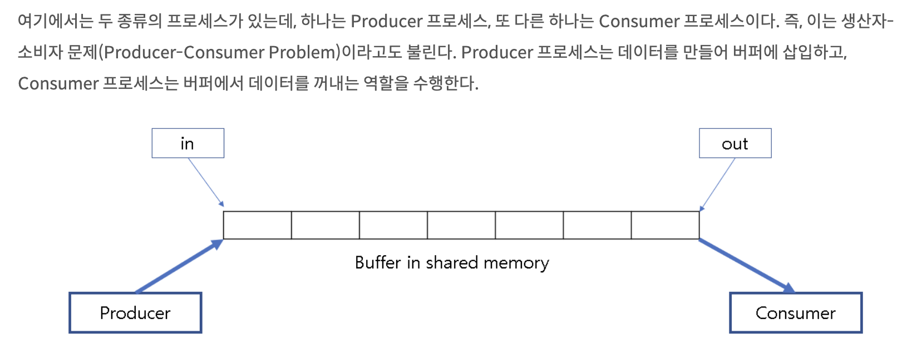

# 8주차 스터디 정리

## 동시성 제어 문제들(Concurrency-Control Problems)
- The Bounded-Buffer Problem
- The Readers-Writers Problem
- The Dining-Philosophers Problem
  
  
## The Bounded-Buffer Problem

  

**Shared Data Structures**  
```c
    int n;
    semaphore mutex = 1;
    semaphore empty = n;
    semaphore full = 0;
```
- A binary semaphore **mutex** : mutual exclusion을 보장해주는 세마포어
- Two counting semaphores **empty and full** : empty와 full 버퍼의 개수를 세기 위한 세마포어
  
**Producer Process의 구조**  
```c
    while (true) {
        // produce an item in next_produced

        wait(empty); // consumer가 버퍼를 다 비울 때까지 wait
        wait(mutex); // 여러 개의 producer 중에 하나만 버퍼에 진입할 수 있도록

        // add next_produced to the buffer

        signal(mutex); // c.s 구간 실행 완료 후, mutex 반납
        signal(full); // 모든 producer들이 생산을 완료하면, consumer들이 버퍼에 접근하도록 알림
    }
```
  
**Consumer Process의 구조**  
```c
    while (true) {
        wait(full);
        wait(mutex);

        // remove an item from buffer to next_consumed

        signal(mutex);
        signal(empty);

        // consume an item in next_consumed
    }
```


## The Readers-Writers Problem


## The Dining-Philosophers Problem