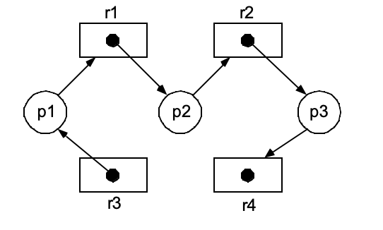

# 9주차 스터디 정리

## deadlock이란?
모든 프로세스들이 
같은 집합에 속해있는 다른 프로세스의 event가 발생하여 
waiting queue를 빠져나올 수 있도록 기다리고 있는 상황

프로세스가 리소스를 점유하고 놓아주지 않거나, 
어떠한 프로세스도 리소스를 점유하지 못하는 상태가 되어 
프로그램이 멈추는 현상

## System Model
Thread는 다음과 같은 흐름으로 Resource를 이용한다. 
- Request
- Use
- Release

## Deadlock Characterization
데드락은 다음 4가지 상황을 만족해야 발생한다. 4가지 조건 중 하나만 만족되지 않아도 데드락은 발생하지 않는다.
- Mutual Exclusion(상호 배제)
    - 적어도 하나 이상의 리소스가 non-sharable mode
    - 여러 프로세스 중 하나만 critical section에 진입할 수 있는 상황이 존재
    - ex. 모든 프로세스가 특정 File을 READ만 한다면 Mutual Exclusion이 필요하지 않으며, 당연히 deadlock도 발생하지 않는다. WRITE를 수행하는 프로세스가 적어도 1개는 있어야 Mutual Exclusion이 필요하며 deadlock이 발생한다. 
- Hold and wait(점유 대기)
    - 프로세스가 하나 (or more)의 리소스를 점유(hold)하고 있으면서, 다른 리소스들에 대한 점유권 획득을 기다리고 있는 상황
    - 프로세스 하나가 리소스를 점유(hold)하고 있고, 다른 프로세스들이 해당 리소스에 대한 점유를 기다리고 있어야 deadlock이 발생한다. 
- No preemption(선점 불가)
    - 다른 프로세스 혹은 OS가 리소스를 점유 중인 프로세스를 쫒아낼 수 없을 때 deadlock이 발생할 수 있다. 
- Circular Wait(원형 대기)
    - 프로세스가 순환적으로 서로를 기다리는 구조일 때 deadlock이 발생할 수 있다. 
    - P0가 P1을, P1이 P2를, Pn이 다시 P0를 기다리는 구조

## Resource Allocation Graph(자원 할당 그래프)
프로세스 간의 관계를 RAG로 도식화해 보면 deadlock이 발생할지 예측해볼 수 있다.   
두 종류의 node
- T : thread/process를 의미, Circle로 표기
- R : resource를 의미, Box로 표기  

두 종류의 edge
- T -> R : request edge
- R -> T : assignment edge

Cycle이 없다면, 절대로 deadlock이 발생할 수 없다.  
Cycle이 있다면, deadlock이 발생할 가능성이 존재한다. 

  

Cycle이 없으므로 절대로 deadlock이 발생하지 않는다.  
  

  

Cycle이 있으므로 deadlock이 발생할 가능성이 존재한다.  
  
  

## 3 ways of Dealing with Deadlock Problem
- ignore the problem(The Ostrich Approach)
- prevent or avoid deadlock
    - Deadlock Prevention
    - Deadlock Avoidance(Banker's 알고리즘)
- detection & recovery

## Deadlock Prevention
Deadlock이 발생하는 4가지 조건들 중 하나만 발생을 막으면 deadlock이 발생하지 않을거야!

- Mutual Exclusion 
- Hold and wait
- No preemption 
- **Circular wait**(sometimes practical) 

## Deadlock Avoidance

