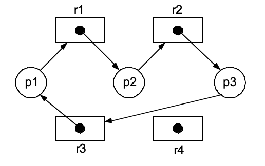
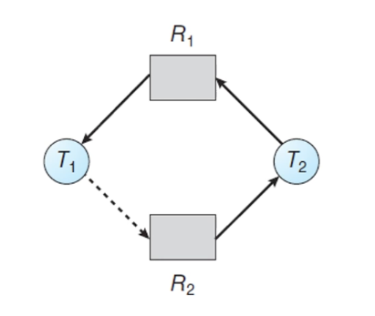
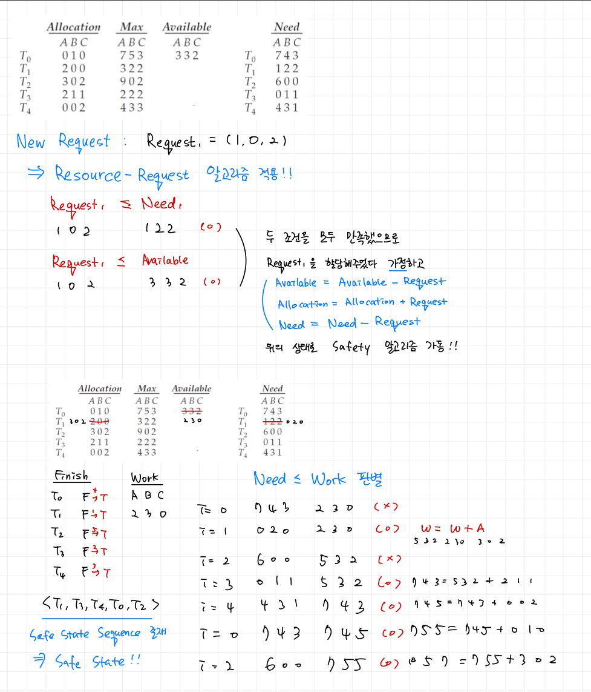

# 9주차 스터디 정리

## deadlock이란?
모든 프로세스들이 
같은 집합에 속해있는 다른 프로세스의 event가 발생하여 
waiting queue를 빠져나올 수 있도록 기다리고 있는 상황

프로세스가 리소스를 점유하고 놓아주지 않거나, 
어떠한 프로세스도 리소스를 점유하지 못하는 상태가 되어 
프로그램이 멈추는 현상

## System Model
Thread는 다음과 같은 흐름으로 Resource를 이용한다. 
- Request
- Use
- Release

## Deadlock Characterization
데드락은 다음 4가지 상황을 만족해야 발생한다. 4가지 조건 중 하나만 만족되지 않아도 데드락은 발생하지 않는다.
- Mutual Exclusion(상호 배제)
    - 적어도 하나 이상의 리소스가 non-sharable mode
    - 여러 프로세스 중 하나만 critical section에 진입할 수 있는 상황이 존재
    - ex. 모든 프로세스가 특정 File을 READ만 한다면 Mutual Exclusion이 필요하지 않으며, 당연히 deadlock도 발생하지 않는다. WRITE를 수행하는 프로세스가 적어도 1개는 있어야 Mutual Exclusion이 필요하며 deadlock이 발생한다. 
- Hold and wait(점유 대기)
    - 프로세스가 하나 (or more)의 리소스를 점유(hold)하고 있으면서, 다른 리소스들에 대한 점유권 획득을 기다리고 있는 상황
    - 프로세스 하나가 리소스를 점유(hold)하고 있고, 다른 프로세스들이 해당 리소스에 대한 점유를 기다리고 있어야 deadlock이 발생한다. 
- No preemption(선점 불가)
    - 다른 프로세스 혹은 OS가 리소스를 점유 중인 프로세스를 쫒아낼 수 없을 때 deadlock이 발생할 수 있다. 
- Circular Wait(원형 대기)
    - 프로세스가 순환적으로 서로를 기다리는 구조일 때 deadlock이 발생할 수 있다. 
    - P0가 P1을, P1이 P2를, Pn이 다시 P0를 기다리는 구조

## Resource Allocation Graph(자원 할당 그래프)
프로세스 간의 관계를 RAG로 도식화해 보면 deadlock이 발생할지 예측해볼 수 있다.   
두 종류의 node
- T : thread/process를 의미, Circle로 표기
- R : resource를 의미, Box로 표기  

두 종류의 edge
- T -> R : request edge
- R -> T : assignment edge

Cycle이 없다면, 절대로 deadlock이 발생할 수 없다.  
Cycle이 있다면, deadlock이 발생할 가능성이 존재한다. 

  

Cycle이 없으므로 절대로 deadlock이 발생하지 않는다.  
  

  

Cycle이 있으므로 deadlock이 발생할 가능성이 존재한다.  
  
  

## 3 ways of Dealing with Deadlock Problem
- Deadlock 문제 자체를 무시해버리는 방법(The Ostrich Approach)
    - 사실상 대부분의 운영체제가 이 방법을 사용. 아래 두 방법은 비용이 높기 때문에
    - 문제가 있는 프로세스를 Kill 하거나 시스템 자체를 리부팅하여 Deadlock 문제를 해결
- Deadlock 현상 자체를 미연에 방지하는 방법
    - Deadlock Prevention
    - Deadlock Avoidance(Banker's 알고리즘)
- Deadlock 상태를 허용하면서 그것을 복구하는 방법
    - Deadlock Detection
    - Recovery from Deadlock
    - 현재 상태를 주기적으로 체크하면서 Deadlock 상태인지를 확인하며 Deadlock에 빠지면 복구를 진행

## Deadlock Prevention
Deadlock이 발생하는 4가지 조건들 중 하나만 발생을 막으면 deadlock이 발생하지 않을거야!

- Mutual Exclusion 
- Hold and wait
- No preemption 
- **Circular wait**(sometimes practical) 

## Deadlock Avoidance
운영체제에게 자원 요청이 들어오면 자원을 할당해주었다고 가정한 상태에서 잠재적으로 Deadlock이 일어나는지 유무를 판단하여 Deadlock이 일어난다면 자원이 충분함에도 불구하고 할당해주지 않는 방법
  

**Safe State** 
- deadlock이 발생하지 않는 상태
- Safe State라면 Deadlock은 반드시 일어나지 않고, Safe State가 아니라면 Deadlock은 발생할 수도 안 할 수도 있음
- 프로세스 간 자원 할당 순서 중 Safe State Sequence가 하나라도 존재한다면 Safe State라고 판단
- Safe State Sequence : 자원을 필요로 하는 프로세스들에게 자원을 할당해주는 순서
- 현재 이용 가능한 자원, 현재 각각의 프로세스에게 할당되어 있는 자원 그리고 각각의 프로세스들이 사용하고 반납할 자원들의 정보를 바탕으로 Safe State Sequence를 찾음
  

**각각의 리소스의 인스턴스가 1개일 때 : RAG로 safe state를 판단**
- cycle이 없다면 safe state
- cycle이 존재한다면 safe state X => deadlock 발생 가능성 있음
 
  

**각각의 리소스의 인스턴스가 여러개일 때 : Banker's algorithm으로 safe state를 판단**
1. resource-request가 들어오면, Resource Request Algorithm을 통해 해당 프로세스가 요청한 자원에 대해 할당이 가능한지를 판단
2. Resource Request Algorithm의 두 조건을 모두 만족하면, Safety Algorithm을 통해 Safe State인지 검사
3. Safe State일 때만 자원을 할당해주기
  
- 필요한 자료구조 나열
    - n : 프로세스의 개수, m : 자원 타입의 개수
    - Available : m 길이의 Vector로 현재 자원들의 할당 가능한 인스턴스들을 나타냅니다.
    - Max : n X m 형태의 Matrix로 Max[i, j] = k라면 이는 P(i) 프로세스는 작업을 완료하기 위해 R(j) 자원을 최대 k 개 필요함을 의미.
    - Allocation : n X m 형태의 Matrix로 Allocation[i, j] = k라면 현재 P(i) 프로세스는 R(j) 자원을 k 개 할당받았다는 것을 의미.
    - Need : n X m 형태의 Matrix로 Need[i, j] = k라면 현재 P(i) 프로세스는 작업을 완료하기까지 R(j) 자원을 k 개 더 필요함을 의미.
    - 즉 Max[i, j] - Allocation[i, j] = Need[i, j]

- Resource Request Algorithm
    - Request <= Need
    - Request <= Available
    - 만약 위 두 조건을 모두 만족하면 Request를 할당해주었다고 가정하고
        - Available = Available - Request
        - Allocation = Allocation + Request
        - Need = Need - Request
    - 위 상태로 Safety Algorithm 가동하기!!
  
- Safety Algorithm
    - 우선 Work = Available, Finish[i]=false(i=0~n-1)로 초기화
    - 각 thread에 대해 아래 조건을 만족하면
        1. Finish[i]==false
        2. Need < Work
    - Work = Work + Allocation, Finish[i]=true
    - 위 두 조건을 검사하는 loop을 돌림
    - 모든 Thread에 대해 Finish[i]=true이면, safe state!!
  
 

  

## Deadlock Detection 

## Recovery from Deadlock

